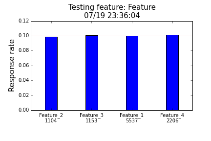

# Script collection for feature engeineering


### categoricalFeatureTest

Feature selection by testing the correlation between a categorical feature and a binary response variable.

**Usage:**
```Python
import FeatureTest

# Using with your data:
categoricalFeatureTest(feature, response, featureName="featureName", writeFile=True)

# To test function use the built in tester:
testCategoricalFeatutreTest(10000)

```

**Output:**
```
Number of items: 10000
Average response rate: 0.0998
Number of features: 4
Features:
Feature_2 n=1116 response rate=0.0905017921147
Feature_3 n=1075 response rate=0.106046511628
Feature_1 n=5635 response rate=0.102395740905
Feature_4 n=2174 response rate=0.0947562097516
```

At the same time, a plot is also generated:

