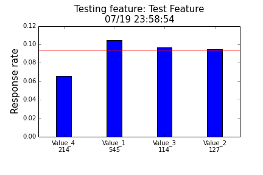
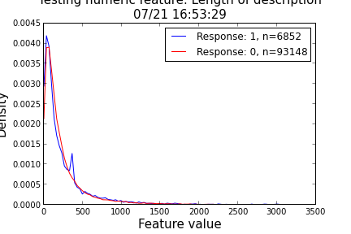

# Script collection for feature engineering


### categoricalFeatureTest

Feature selection by testing the correlation between a categorical feature and a binary response variable.

**Usage:**
```Python
import FeatureTest as ft

# Using with your data:
ft.categoricalFeatureTest(feature, response, featureName="featureName", writeFile=True)

# To test function use the built in tester that simulate a feature with 4 values
ft.testCategoricalFeatutreTest(length=1000)

```

**Output:**
```
Number of items: 1000
Average response rate: 0.094
The tested feature has: 4 values
List of values:
Value_4 n=214 response rate=0.0654205607477
Value_1 n=545 response rate=0.104587155963
Value_3 n=114 response rate=0.0964912280702
Value_2 n=127 response rate=0.0944881889764

```

At the same time, a barchart is also generated:




### testing numeric features

Visualizing the distribution of a selected feature, where the feature is borken down according to the response variable

**Usage:**
```Python
import FeatureTest as ft

# Using with your data:
ft.numericalFeatureTest(feature, response, featureName="featureName", writeFile=True)

# To test function use the built in tester that simulate a feature with 4 values
ft.testNumericalFeatureTest(length=1000)

```

Testing on the length of description feature:


