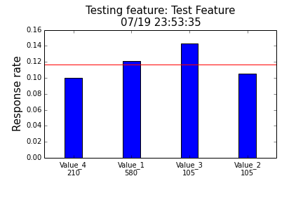

# Script collection for feature engineering


### categoricalFeatureTest

Feature selection by testing the correlation between a categorical feature and a binary response variable.

**Usage:**
```Python
import FeatureTest

# Using with your data:
categoricalFeatureTest(feature, response, featureName="featureName", writeFile=True)

# To test function use the built in tester:
testCategoricalFeatutreTest()

```

**Output:**
```
Number of items: 1000
Average response rate: 0.117
Number of features: 4
Features:
Value_4 n=210 response rate=0.1
Value_1 n=580 response rate=0.120689655172
Value_3 n=105 response rate=0.142857142857
Value_2 n=105 response rate=0.104761904762

```

At the same time, a barchart is also generated:


